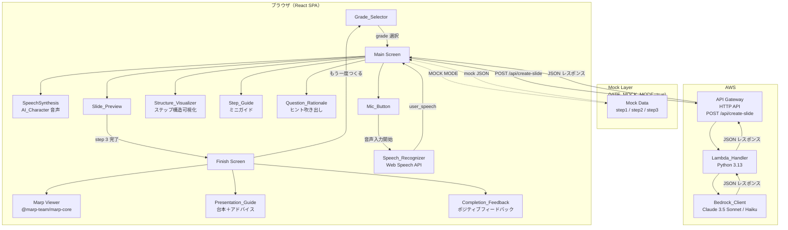
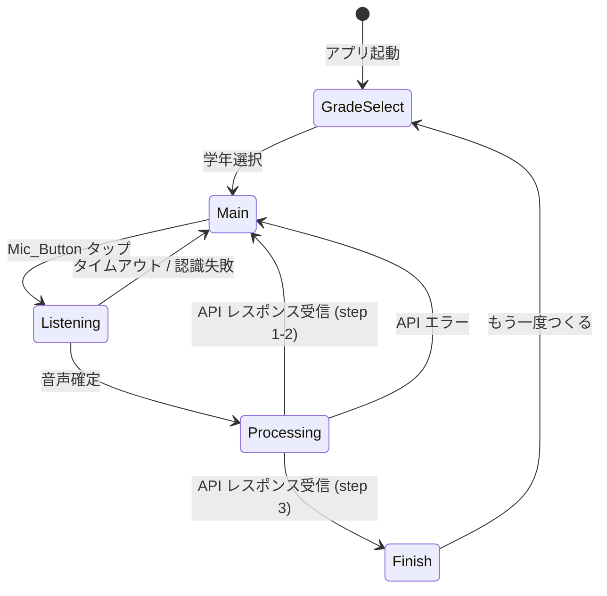
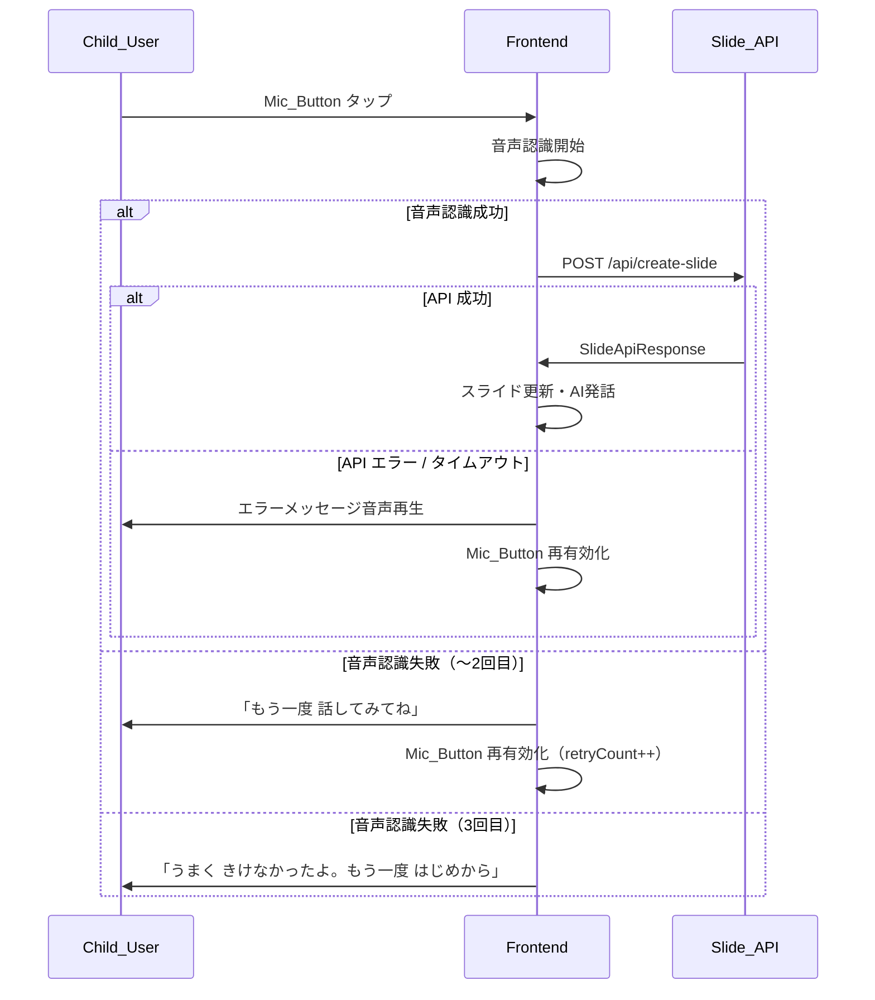

# Design Document: はなして・つくるん

## Overview

「はなして・つくるん」は、幼稚園〜中学生以上の子どもを対象とした音声対話型スライドビルダーWebアプリケーションである。ユーザーはキーボードを一切操作せず、AIキャラクター（優しい女性の先生）との3ターンの音声会話だけで、「紙芝居風スライド3枚」と「サンプルスライド（Marp形式）」を完成させることができる。完成画面では Marp によるスライドレンダリングに加え、各ページごとの台本とプレゼンアドバイス（Presentation_Guide）が表示される。

### 設計の方針

- **キーボード不要**: すべての操作は音声入力とタッチ/マウスクリックのみ
- **漸進的開示**: 3ステップ（つかみ→展開→結論）のシンプルなフローで子どもの認知負荷を最小化
- **テーマに応じた動的質問**: AIがユーザーの回答に基づいて次の質問を動的に調整し、伝えたい内容を引き出す
- **リアルタイムフィードバック**: スライドプレビューの即時更新で達成感を演出
- **Marp スライド出力**: 完成時に Marp 形式の Markdown スライドを生成し、`@marp-team/marp-core` でレンダリング
- **プレゼンガイド**: 各ページの台本＋プレゼンの構造的アドバイスで「伝え方」を学べる
- **モック対応**: `VITE_MOCK_MODE` による開発・デモ用単独動作モード
- **レイアウトバリエーション**: ページごとに異なるレイアウト（lead / two-column / centered）で視覚的多様性を演出
- **CSSアニメーション**: 完成画面でのフェードイン・スライドアップ・スケールアップ等の動きのある演出
- **カスタムMarpテーマ**: `hanashite-pop` テーマによる本格的なプレゼン品質（丸みフォント・パステルカラー）
- **構造ビジュアライザー**: プレゼン構造の各ステップの「なぜ」と「役割」を可視化する Structure_Visualizer
- **体験的学習ガイド**: 各ステップ完了後に構造を学べる Step_Guide（ミニガイド）の表示
- **質問理由の表示**: AI の質問意図を明示する Question_Rationale ヒント吹き出し
- **ポジティブフィードバック**: 完成時に子どもの自己肯定感を育てる Completion_Feedback

### 技術スタック

| レイヤー | 技術 |
|---------|------|
| フロントエンド | React 18 + TypeScript + Vite |
| 音声入力 | Web Speech API (`SpeechRecognition`) |
| 音声出力 | Web Speech API (`SpeechSynthesis`) |
| UIコンポーネント | Lucide React（アイコン） |
| スライドレンダリング | `@marp-team/marp-core`（Marp Markdown → HTML スライド変換） |
| バックエンド | AWS Lambda (Python 3.13) + Amazon API Gateway (HTTP API) |
| AI | Amazon Bedrock – Claude 3.5 Sonnet / Haiku |
| ホスティング | （静的ファイル配信：S3 + CloudFront 等を想定） |

---

## Architecture

### 全体構成図



### フロントエンド状態遷移



---

## Components and Interfaces

### フロントエンド コンポーネント構成

```
src/
├── App.tsx                    # ルートコンポーネント・画面切替
├── components/
│   ├── GradeSelector/
│   │   └── GradeSelector.tsx  # 学年選択画面
│   ├── MainScreen/
│   │   ├── MainScreen.tsx     # メイン画面（スライド作成）
│   │   ├── MicButton.tsx      # 巨大マイクボタン
│   │   ├── AICharacter.tsx    # AIキャラクター吹き出し表示
│   │   ├── StructureVisualizer.tsx  # 構造ビジュアライザー（Progress_Bar を置換）
│   │   ├── StepGuide.tsx      # ステップ完了時ミニガイド表示
│   │   └── QuestionRationale.tsx  # AI質問理由ヒント吹き出し
│   ├── SlidePreview/
│   │   ├── SlidePreview.tsx   # 3枚スライドプレビュー領域
│   │   ├── SlideCard.tsx      # 1枚スライドカード
│   │   └── SlideIcon.tsx      # image_keyword → Lucide アイコン
│   └── FinishScreen/
│       ├── FinishScreen.tsx   # 完成画面（Marpスライド＋ガイド＋フィードバック）
│       ├── MarpSlideViewer.tsx # Marp Markdown → HTML レンダリング＋ページナビ＋CSSアニメーション
│       ├── PresentationGuide.tsx # 台本＋プレゼンアドバイス表示
│       └── CompletionFeedback.tsx # ポジティブフィードバック表示
├── hooks/
│   ├── useSpeechRecognizer.ts # Web Speech API ラッパー
│   ├── useSpeechSynthesis.ts  # SpeechSynthesis ラッパー
│   └── useSlideApi.ts         # Slide_API 呼び出しフック
├── services/
│   └── slideApiService.ts     # HTTP クライアント（モック切替含む）
├── mocks/
│   └── mockResponses.ts       # VITE_MOCK_MODE 用固定レスポンス
├── styles/
│   ├── marp-themes/
│   │   └── hanashite-pop.css  # Marp_Custom_Theme（丸みフォント・パステルカラー）
│   └── slide-animations.css   # 完成画面 Slide_Animation（@keyframes 定義）
├── types/
│   └── index.ts               # 共通型定義
└── utils/
    └── kanjiGrade.ts          # 学年ラベル・定数
```

### 主要コンポーネント インターフェース

#### `GradeSelector`

```typescript
interface GradeSelectorProps {
  onSelect: (grade: Grade) => void;
}
```

#### `MainScreen`

```typescript
interface MainScreenProps {
  grade: Grade;
  onComplete: (slides: SlideData[], marpMarkdown: string, presentationGuide: PresentationGuideEntry[], completionFeedback: string) => void;
  onChangeGrade: () => void;
}
```

#### `MicButton`

```typescript
interface MicButtonProps {
  disabled: boolean;       // AI発話中・API処理中は true
  recording: boolean;      // 録音中は true（アニメーション制御）
  onClick: () => void;
}
```

#### `SlideCard`

```typescript
interface SlideCardProps {
  step: Step;              // 1 | 2 | 3
  data: SlideData | null;  // null = 未完成（プレースホルダー表示）
  loading: boolean;        // API処理中ローディング表示
}
```

#### `SlideIcon`

```typescript
interface SlideIconProps {
  keyword: string;         // image_keyword（英単語）
  size?: number;
}
// keyword を PascalCase に変換し lucide-react から動的ルックアップ
// 存在しない場合は Star アイコンにフォールバック
```

#### `StructureVisualizer`

```typescript
// Structure_Visualizer のステップメタデータ
interface StructureVisualizerStep {
  step: Step;
  label: string;           // ステップ短縮名（「つかみ」「なかみ」「まとめ」）
  description: string;     // 一行説明（例: 「みんなの きょうみを ひく」）
  icon: string;            // Lucide アイコン名（例: "Sparkles", "MessageCircle", "Flag"）
  state: 'completed' | 'current' | 'upcoming';
}

interface StructureVisualizerProps {
  currentStep: Step;       // 1 | 2 | 3
  completedSteps: Step[];  // 完了済みステップ配列
}
// Progress_Bar を置き換え、各ステップの「役割」と「なぜ必要か」を
// アイコン＋一行説明で可視化する。ステップ状態に応じて色・ハイライトを変更。
```

#### `StepGuide`

```typescript
interface StepGuideProps {
  step: Step;              // 完了したステップ番号
  visible: boolean;        // 表示中かどうか
  onDismiss: () => void;   // フェードアウト完了時コールバック
}
// 各ステップ完了直後に表示されるミニガイドメッセージ。
// AI_Character 吹き出しとは視覚的に区別される独立カードデザイン。
// 表示後 5 秒経過または次操作開始で自動フェードアウト。
// Step 1: 「いまのが『つかみ』だよ！みんなが『なんだろう？』っておもう はじめかただね」
// Step 2: 「これが『なかみ』！くわしく はなすと みんなに つたわるよ」
// Step 3: 完成画面遷移に含める
```

#### `QuestionRationale`

```typescript
interface QuestionRationaleProps {
  step: Step;              // 現在のステップ（質問理由テキストを決定）
  visible: boolean;        // トグル状態（表示/非表示）
  onToggle: () => void;    // 表示切替コールバック
}
// AI_Character 吹き出しの下部に配置する小さなヒント吹き出し。
// デフォルトは表示（ON）。トグルボタンで非表示に切替可能。
// 電球アイコン付き、小さめフォント、異なる背景色で視覚的に区別。
// Step 1: 「テーマを はっきり させると、みんなに つたわりやすくなるよ」
// Step 2: 「くわしく はなすと、きいてる ひとが イメージ しやすくなるよ」
// Step 3: 「さいごに きもちを つたえると、みんなの こころに のこるよ」
```

#### `FinishScreen`

```typescript
interface FinishScreenProps {
  marpMarkdown: string;            // Marp 形式の Markdown テキスト
  presentationGuide: PresentationGuideEntry[];  // 3要素の台本＋アドバイス
  completionFeedback: string;      // AI によるポジティブフィードバックテキスト
  onRestart: () => void;
}
// CompletionFeedback セクションをスライドビューアー下部に表示。
// MarpSlideViewer には CSS アニメーションが適用される。
```

#### `MarpSlideViewer`

```typescript
interface MarpSlideViewerProps {
  markdown: string;               // Marp 形式 Markdown（theme: hanashite-pop 指定済み）
  currentPage: number;            // 現在表示中のページ (0-indexed)
  onPageChange: (page: number) => void;
}
// @marp-team/marp-core を使用して Markdown → HTML に変換し、
// 1ページずつ表示。左右ナビゲーションボタンでページ送り。
// hanashite-pop カスタムテーマを適用してレンダリング。
// 各要素に Slide_Animation（フェードイン・スライドアップ・スケールアップ）を適用。
// ページ遷移時にはスライドまたはフェードの CSS トランジションを適用。
// アニメーションは slide-animations.css で定義された @keyframes を使用。
```

#### `CompletionFeedback`

```typescript
interface CompletionFeedbackProps {
  feedback: string;               // AI によるポジティブフィードバックテキスト
}
// 完成画面でスライドビューアーの下部に表示されるカード。
// AI_Character の口調（優しい先生の話し方）で、Child_User の発話内容に基づいた
// 具体的な褒め言葉を表示する。
// デザイン: 星アイコン付き、パステルカラー背景、角丸カード。
// テーマ選び（Step 1）・詳細説明（Step 2）・まとめ（Step 3）の
// それぞれに対するポジティブコメントを含む。
```

#### `PresentationGuide`

```typescript
interface PresentationGuideProps {
  guide: PresentationGuideEntry;  // 現在のページに対応するガイド
}
// 「このページで はなすこと」ラベル下に script を表示
// 「プレゼンの コツ」ラベル下に advice を表示
```

### Slide_Animation CSS仕様

完成画面（FinishScreen）で適用される CSS アニメーション定義。`src/styles/slide-animations.css` に格納する。

```css
/* slide-animations.css - Slide_Animation 定義 */

/* ページ内要素アニメーション */
@keyframes fadeIn {
  from { opacity: 0; }
  to { opacity: 1; }
}

@keyframes slideUp {
  from { opacity: 0; transform: translateY(20px); }
  to { opacity: 1; transform: translateY(0); }
}

@keyframes scaleUp {
  from { transform: scale(0); }
  to { transform: scale(1); }
}

/* ページ遷移トランジション */
@keyframes slideInFromRight {
  from { opacity: 0; transform: translateX(30px); }
  to { opacity: 1; transform: translateX(0); }
}

@keyframes slideInFromLeft {
  from { opacity: 0; transform: translateX(-30px); }
  to { opacity: 1; transform: translateX(0); }
}

/* 適用クラス */
.slide-title { animation: fadeIn 0.5s ease-out forwards; }
.slide-text { animation: slideUp 0.5s ease-out 0.3s forwards; opacity: 0; }
.slide-icon { animation: scaleUp 0.4s cubic-bezier(0.175, 0.885, 0.32, 1.275) 0.5s forwards; transform: scale(0); }
.slide-page-enter { animation: slideInFromRight 0.3s ease-out forwards; }
.slide-page-enter-reverse { animation: slideInFromLeft 0.3s ease-out forwards; }
```

**制約事項:**
- すべてのアニメーションは純粋な CSS（`@keyframes` および `transition`）のみで実装し、JavaScript によるアニメーション制御を使用しない
- アニメーション全体の再生時間は 1 秒以内に収め、Child_User の操作を阻害しない
- `prefers-reduced-motion: reduce` メディアクエリを尊重し、アニメーション無効化に対応する

### Marp_Custom_Theme 仕様

`src/styles/marp-themes/hanashite-pop.css` に格納するカスタム Marp テーマ。

```css
/* @theme hanashite-pop */

/* Marp カスタムテーマ: 子ども向け親しみやすいデザイン */
section {
  font-family: 'Rounded Mplus 1c', 'BIZ UDPGothic', sans-serif;
  background: linear-gradient(135deg, #fef9f3 0%, #fdf2e9 100%);
  color: #4a3728;
}

section.lead {
  text-align: center;
  justify-content: center;
}

section.lead h1 {
  font-size: 2.5em;
  color: #e8734a;
}

section.two-column {
  display: grid;
  grid-template-columns: 1fr 1fr;
  grid-template-rows: auto 1fr;
  gap: 1em;
  align-items: center;
}

section.two-column h1 {
  grid-column: 1 / -1;
}

section.two-column .left {
  grid-column: 1;
}

section.two-column .right {
  grid-column: 2;
  text-align: center;
}

section.centered {
  text-align: center;
  justify-content: center;
  background: linear-gradient(135deg, #e8f4fd 0%, #d4edfc 100%);
}

h1 {
  color: #e8734a;
  border-bottom: 3px solid #f9c74f;
  padding-bottom: 0.3em;
}

blockquote {
  border-left: 4px solid #90be6d;
  background: #f8fff0;
  padding: 0.5em 1em;
  border-radius: 8px;
}

header, footer {
  font-size: 0.6em;
  color: #8b7355;
}
```

**テーマ特徴:**
- 丸みのあるフォント（Rounded Mplus 1c）
- パステルカラーの配色（暖色系グラデーション背景）
- 子ども向けの親しみやすいデザイン（角丸・柔らかい色彩）
- `lead` クラス: ページ1用（タイトル中央配置・大文字）
- `two-column` クラス: ページ2用（CSS Grid による2カラムレイアウト）
- `centered` クラス: ページ3用（中央配置・青系グラデーション）

### カスタムフック インターフェース

#### `useSpeechRecognizer`

```typescript
interface SpeechRecognizerState {
  isListening: boolean;
  transcript: string;
  error: string | null;
}

function useSpeechRecognizer(options: {
  lang: string;            // 'ja-JP'
  timeoutMs: number;       // 10000 (10秒)
  maxRetries: number;      // 2
  onResult: (text: string) => void;
  onTimeout: () => void;
  onError: (retryCount: number) => void;
}): {
  state: SpeechRecognizerState;
  start: () => void;
  stop: () => void;
}
```

#### `useSpeechSynthesis`

```typescript
function useSpeechSynthesis(): {
  speak: (text: string, onEnd?: () => void) => void;
  isSpeaking: boolean;
  cancel: () => void;
}
```

#### `useSlideApi`

```typescript
function useSlideApi(): {
  call: (req: SlideApiRequest) => Promise<SlideApiResponse>;
  loading: boolean;
  error: string | null;
}
```

### バックエンド Lambda ハンドラー インターフェース

```python
# エントリポイント: handler.py
import json
from typing import Any

def lambda_handler(event: dict[str, Any], context: Any) -> dict[str, Any]:
    ...
```

バックエンド内部モジュール構成:

```
lambda/
├── handler.py          # Lambda エントリポイント
├── validator.py        # リクエストバリデーション
├── kanji_filter.py     # Kanji_Filter（grade 別プロンプト指示生成）
├── bedrock_client.py   # Bedrock_Client（invoke_model ラッパー）
├── slide_exporter.py   # Slide_Exporter（step3 Marp Markdown + presentation_guide 生成指示）
└── types.py            # 共通型定義（TypedDict / dataclass）
```

---

## Data Models

### フロントエンド 型定義

```typescript
// 学年区分
type Grade = 'grade0' | 'grade1' | 'grade2' | 'grade3'
           | 'grade4' | 'grade5' | 'grade6' | 'grade7';

// スライド作成ステップ
type Step = 1 | 2 | 3;

// 1枚分のスライドデータ
interface SlideData {
  step: Step;
  slide_title: string;
  slide_text: string;
  image_keyword: string;
}

// Slide_API リクエスト
interface SlideApiRequest {
  grade: Grade;
  current_step: Step;
  user_speech: string;    // 1文字以上
  history: HistoryEntry[];
}

// Slide_API レスポンス
interface SlideApiResponse {
  slide_title: string;
  slide_text: string;
  image_keyword: string;  // 英単語
  ai_response_voice: string;
  next_step: 2 | 3 | 4;  // 4 = 完成
  marp_markdown: string;  // step 3 のみ Marp 形式 Markdown（3ページ）、それ以外は空文字
  presentation_guide: PresentationGuideEntry[];  // step 3 のみ3要素、それ以外は空配列
  completion_feedback: string;  // step 3 のみ Child_User へのポジティブフィードバック、それ以外は空文字
}

// Presentation Guide エントリ
interface PresentationGuideEntry {
  page: 1 | 2 | 3;
  script: string;         // そのページで話す台本
  advice: string;         // プレゼンの構造・伝え方アドバイス
}

// 会話履歴エントリ
interface HistoryEntry {
  role: 'user' | 'assistant';
  content: string;
}

// アプリグローバル状態
interface AppState {
  screen: 'grade_select' | 'main' | 'finish';
  grade: Grade | null;
  currentStep: Step;
  completedSteps: Step[];
  slides: (SlideData | null)[];  // インデックス 0=step1, 1=step2, 2=step3
  history: HistoryEntry[];       // 最大20件
  marpMarkdown: string;          // step 3 完了時に設定
  presentationGuide: PresentationGuideEntry[];  // step 3 完了時に設定
  completionFeedback: string;    // step 3 完了時に設定（ポジティブフィードバック）
  stepGuideVisible: boolean;     // Step_Guide 表示中フラグ
  questionRationaleVisible: boolean;  // Question_Rationale 表示トグル（デフォルト: true）
}

// Structure_Visualizer ステップメタデータ定義
const STRUCTURE_STEPS: StructureVisualizerStep[] = [
  { step: 1, label: 'つかみ', description: 'みんなの きょうみを ひく', icon: 'Sparkles' },
  { step: 2, label: 'なかみ', description: 'いちばん つたえたい ことを はなす', icon: 'MessageCircle' },
  { step: 3, label: 'まとめ', description: 'さいごに まとめて つたえる', icon: 'Flag' },
];

// Step_Guide メッセージ定義
const STEP_GUIDE_MESSAGES: Record<Step, string> = {
  1: "いまのが『つかみ』だよ！みんなが『なんだろう？』っておもう はじめかただね",
  2: "これが『なかみ』！くわしく はなすと みんなに つたわるよ",
  3: "", // Step 3 完了時は完成画面遷移のため Step_Guide 不要
};

// Question_Rationale メッセージ定義
const QUESTION_RATIONALE_MESSAGES: Record<Step, string> = {
  1: "テーマを はっきり させると、みんなに つたわりやすくなるよ",
  2: "くわしく はなすと、きいてる ひとが イメージ しやすくなるよ",
  3: "さいごに きもちを つたえると、みんなの こころに のこるよ",
};
```

### Bedrock プロンプト構造

Lambda_Handler は以下の構造でプロンプトを組み立てる:

```
system: |
  あなたは優しい女性の先生AIキャラクターです。
  小学生の発表会用スライドを一緒に作ります。
  
  【出力フォーマット（JSON）】
  {
    "slide_title": "...",
    "slide_text": "...",
    "image_keyword": "英単語1語",
    "ai_response_voice": "次の質問または完成メッセージ",
    "next_step": <2|3|4>,
    "marp_markdown": "<step3のみ Marp形式Markdown 3ページ、それ以外は空文字>",
    "presentation_guide": [<step3のみ3要素、それ以外は空配列>],
    "completion_feedback": "<step3のみ ポジティブフィードバック、それ以外は空文字>"
  }
  
  【漢字制限】
  <grade に応じた Kanji_Filter プロンプト指示>
  この制限は「slide_text」「ai_response_voice」「marp_markdown」
  「presentation_guide 内の script / advice」のすべてに適用してください。
  
  【現在のステップ】step <current_step>
  
  【ステップ別質問指示】
  <step1: テーマの輪郭を具体化する質問。「それってどんなもの？」
   「みんなに知ってほしいポイントは？」のようにテーマを掘り下げる>
  <step2: Step1で得たテーマに基づき、具体的なエピソードや詳細を引き出す質問。
   「いちばんすきなところ」「おもしろかったこと」「びっくりしたこと」>
  <step3: これまでの会話を踏まえた締めくくりの質問。
   「さいごにみんなにつたえたいきもちは？」「これからどうしたい？」>
  
  <Slide_Exporter 指示（step3のみ）>

messages: <history 配列> + [{ role: "user", content: user_speech }]
```

### Slide_Exporter プロンプト指示（step 3 のみ）

```
【Marp スライド生成指示】
marp_markdownフィールドに以下の形式でMarp Markdownを生成してください：
- 先頭に YAML フロントマター: ---\nmarp: true\ntheme: hanashite-pop\npaginate: true\nheader: "{発表テーマタイトル}"\nfooter: "わたしの はっぴょう"\n---
- 各スライドを --- で区切った3ページ構成
- 各ページに対応するステップの slide_title を見出し（#）、slide_text を本文
- image_keyword を <!-- icon: {keyword} --> コメントとして埋め込む

【レイアウトバリエーション指示】
- ページ1（つかみ）: Marp ディレクティブ `<!-- _class: lead -->` を適用。タイトル大きく中央配置、アイコン大サイズ表示
- ページ2（なかみ）: Marp ディレクティブ `<!-- _class: two-column -->` を適用。左カラムに slide_text 本文、右カラムに image_keyword アイコン/イラスト配置
- ページ3（まとめ）: グラデーション背景＋中央配置テキスト。`<!-- _class: centered -->` を適用、アイコン小サイズ

【テキスト装飾指示】
- 本文テキスト内の重要キーワードに太字（`**キーワード**`）を自動適用
- Child_User の発話に基づき適切な箇所に引用記法（`>`）を使用してメッセージ性を強調
- 各ページの内容に関連する絵文字を本文中に1つ以上自動挿入

【プレゼンガイド生成指示】
presentation_guideフィールドに以下の3要素の配列を生成してください：
- page 1: 導入の台本（script）+ 「つかみ」の役割アドバイス（advice）
  - advice例: 聞き手の興味を引くための話し方のコツを小学生にわかる言葉で
- page 2: 展開の台本（script）+ 「いちばんつたえたいこと」の役割アドバイス（advice）
  - advice例: 具体例を使って印象づける方法を小学生にわかる言葉で
- page 3: 結論の台本（script）+ 「まとめ」の役割アドバイス（advice）
  - advice例: 気持ちを伝えてまとめる方法を小学生にわかる言葉で

【ポジティブフィードバック生成指示】
completion_feedbackフィールドに、Child_User の発表内容に対するポジティブフィードバックを生成してください：
- AI_Character（優しい先生）の口調で記述
- テーマ選び（Step 1）への具体的な褒め言葉を1つ以上含む
- 詳細説明（Step 2）への具体的な褒め言葉を1つ以上含む
- まとめ（Step 3）への具体的な褒め言葉を1つ以上含む
- Child_User の実際の発話内容に基づいた具体的な表現を使用する
```

### Kanji_Filter プロンプト指示マッピング

| grade | プロンプト指示 |
|-------|---------------|
| grade0 | 漢字を一切使わず、ひらがな・カタカナのみで出力してください。 |
| grade1 | 文部科学省指定の小学1年生配当漢字（80字）のみ使用してください。それ以外の漢字はひらがなで書いてください。 |
| grade2 | 文部科学省指定の小学1〜2年生配当漢字（計240字）のみ使用してください。 |
| grade3 | 文部科学省指定の小学1〜3年生配当漢字（計440字）のみ使用してください。 |
| grade4 | 文部科学省指定の小学1〜4年生配当漢字（計640字）のみ使用してください。 |
| grade5 | 文部科学省指定の小学1〜5年生配当漢字（計825字）のみ使用してください。 |
| grade6 | 文部科学省指定の小学1〜6年生配当漢字（計1026字）のみ使用してください。 |
| grade7 | 常用漢字（2136字）の範囲内で漢字を自由に使用してください。 |

**適用対象フィールド（全 grade 共通）:**
`slide_text`, `ai_response_voice`, `marp_markdown`, `presentation_guide` 内の `script` / `advice`, `completion_feedback`

> **バグ修正メモ**: 旧実装では `slide_text` と `ai_response_voice` のみに漢字制限を明示していたため、`script`（旧）フィールドに制限が効いていなかった。新実装ではプロンプト指示文に全出力フィールドへの適用を明記する。

### モックデータ構造

```typescript
// src/mocks/mockResponses.ts
export const MOCK_RESPONSES: Record<Step, SlideApiResponse> = {
  1: {
    slide_title: "すきなどうぶつ",
    slide_text: "ぼくはいぬがすきです",
    image_keyword: "dog",
    ai_response_voice: "いいね！いぬの どんなところが すきなの？いちばん おもしろいなって おもうことを おしえて！",
    next_step: 2,
    marp_markdown: "",
    presentation_guide: [],
    completion_feedback: ""
  },
  2: {
    slide_title: "いちばん すきなところ",
    slide_text: "なでるとふわふわでかわいい",
    image_keyword: "heart",
    ai_response_voice: "ふわふわで かわいいんだね！さいごに、いぬと これから どうしたいか、みんなに つたえたい きもちを おしえて！",
    next_step: 3,
    marp_markdown: "",
    presentation_guide: [],
    completion_feedback: ""
  },
  3: {
    slide_title: "まとめ",
    slide_text: "いぬはともだちです",
    image_keyword: "star",
    ai_response_voice: "すばらしい はっぴょうが できたよ！",
    next_step: 4,
    marp_markdown: `---
marp: true
theme: hanashite-pop
paginate: true
header: "すきなどうぶつ"
footer: "わたしの はっぴょう"
---

<!-- _class: lead -->

# すきなどうぶつ 🐕

**ぼく**はいぬがすきです

<!-- icon: dog -->

---

<!-- _class: two-column -->

# いちばん すきなところ 💕

> なでると ふわふわで **かわいい**

<!-- icon: heart -->

---

<!-- _class: centered -->

# まとめ ⭐

いぬは ぼくの **ともだち**です

<!-- icon: star -->`,
    presentation_guide: [
      {
        page: 1,
        script: "みなさん、こんにちは。きょうは ぼくの すきな どうぶつ、いぬについて おはなしします。",
        advice: "さいしょに じこしょうかいと テーマを つたえよう。みんなが「なんの はなしかな？」と きになるように はなすのが コツだよ！"
      },
      {
        page: 2,
        script: "ぼくが いぬの いちばん すきなところは、なでると ふわふわで かわいいところです。まいにち いっしょに あそんでいます。",
        advice: "いちばん つたえたい ことを くわしく はなそう。「いつ」「どこで」「どんなふうに」を いれると、みんなに つたわりやすいよ！"
      },
      {
        page: 3,
        script: "いぬは ぼくの だいすきな ともだちです。これからも ずっと なかよく していきたいです。",
        advice: "さいごは じぶんの きもちで しめよう。「だから ○○です」「これからも ○○したいです」と まとめると、きいている ひとが なっとく するよ！"
      }
    ],
    completion_feedback: "すごいね！「いぬ」っていう みんなが しっている どうぶつを えらんだのが とっても いいね。「ふわふわで かわいい」って くわしく おしえてくれたから、みんなも いぬを なでたくなったと おもうよ。さいごに「ともだちです」って きもちを つたえられたのが すばらしいね！"
  }
};
```

---

## Correctness Properties

*A property is a characteristic or behavior that should hold true across all valid executions of a system — essentially, a formal statement about what the system should do. Properties serve as the bridge between human-readable specifications and machine-verifiable correctness guarantees.*

> **プリワーク要約**: 17要件・受入基準を分析し、Property（普遍的性質・プロパティテスト向き）12項目、Example（具体例・ユニットテスト向き）多数、Edge_Case 数件を特定した。プロパティ間の重複を検討した結果、2.5・2.6・10.3（AI発話中の状態一貫性）は1つのプロパティに統合した。新規要件（K3, K6, K7, W1, W2, W3, W4）に対して Property 10〜12 を追加した。

---

### Property 1: 会話履歴の最大件数上限（History Capped）

*For any* 発話操作の繰り返し回数（21回以上を含む）に対して、`history` 配列のエントリ数は常に 20 件以下である。

**Validates: Requirements 8.4**

---

### Property 2: 会話履歴のラウンドトリップ整合性（History Round-Trip）

*For any* ユーザー発話テキスト `user_speech` と対応する `ai_response_voice` テキストのペアについて、Slide_API レスポンス受信後に `history` 配列を参照すると、末尾に `{ role: "user", content: user_speech }` と `{ role: "assistant", content: ai_response_voice }` の2エントリが正しく追記されている。

**Validates: Requirements 8.2, 8.3**

---

### Property 3: 学年別漢字制限の適用（Kanji Constraint Propagation）

*For any* `grade` 値（grade0〜grade7）について、Bedrock_Client に渡されるプロンプトには、その grade に対応する漢字制限指示（grade0: ひらがな・カタカナのみ〜grade7: 常用漢字制限なし）が含まれている。また `ai_response_voice`、`marp_markdown`、`presentation_guide` 内の `script` / `advice` フィールドに対しても同等の漢字制限指示が含まれている。

**Validates: Requirements 5.1, 5.2, 5.3, 5.4, 5.5, 5.6, 5.7, 5.8, 5.9**

---

### Property 4: 無効リクエストのバリデーション拒否（Request Validation Rejection）

*For any* `grade`（`"grade0"`〜`"grade7"` の範囲外）または `current_step`（1, 2, 3 の範囲外）の値を含むリクエストについて、Lambda_Handler は Bedrock_Client を一切呼び出すことなく HTTP 400 を返す。

**Validates: Requirements 4.8, 5.10**

---

### Property 5: step=3 の Marp Markdown 生成（Marp Output on Final Step）

*For any* `current_step = 3` のリクエストについて、生成されたレスポンス内の `marp_markdown` フィールドは非空文字列であり、先頭に `marp: true` を含む YAML フロントマターを持ち、`---` で区切られた3ページ構成である。また `presentation_guide` フィールドは3要素の配列であり、各要素は `page`（1, 2, 3）、`script`（非空文字列）、`advice`（非空文字列）を持つ。

**Validates: Requirements 7.1, 7.2**

---

### Property 6: step≠3 のとき marp_markdown は空文字列・presentation_guide は空配列（Empty Output for Non-Final Steps）

*For any* `current_step` が 1 または 2 のリクエストについて、レスポンス内の `marp_markdown` フィールドは必ず空文字列 `""` であり、`presentation_guide` フィールドは必ず空配列 `[]` である。

**Validates: Requirements 4.4**

---

### Property 7: SlideIcon のエラーレスフォールバック（Icon Error-Free Fallback）

*For any* 文字列値（有効な Lucide アイコン名・無効な文字列・空文字列を含む）を `image_keyword` として SlideIcon コンポーネントに渡したとき、コンポーネントは必ず何らかの Lucide アイコンを描画し、対応するアイコンが存在しない場合は `Star` アイコンを描画する（例外・描画エラー・undefined レンダリングを一切引き起こさない）。

**Validates: Requirements 6.4, 6.5**

---

### Property 8: Grade_Selector 表示時の履歴完全リセット（History Full Reset）

*For any* `history` 配列の状態（エントリ数 0〜20件）において、Grade_Selector 画面への遷移が発生すると `history` は必ず空配列 `[]` に初期化される。

**Validates: Requirements 8.5**

---

### Property 9: AI_Character 発話中の状態一貫性（Speaking State Consistency）

*For any* `ai_response_voice` テキストについて、AI_Character が音声を再生している（`isSpeaking = true`）あいだは、Mic_Button の `disabled` が `true` であり、かつ `ai_response_voice` のテキストが画面上に表示されている。`isSpeaking = false` に遷移した瞬間、Mic_Button の `disabled` は `false` に戻る。

**Validates: Requirements 2.5, 2.6, 10.3**

---

### Property 10: Layout_Variation の適用（Layout Variation Applied）

*For any* `current_step = 3` のリクエストについて、生成された `marp_markdown` 内の3ページはそれぞれ異なるレイアウトクラスまたはディレクティブを持つ。具体的には、ページ1に `lead` クラス、ページ2に2カラム構造、ページ3に `centered` クラスが適用されている。

**Validates: Requirements 11.1, 11.2, 11.3, 11.4**

---

### Property 11: Completion_Feedback の非空保証（Completion Feedback Non-Empty on Step 3）

*For any* `current_step = 3` のリクエストについて、生成されたレスポンス内の `completion_feedback` フィールドは非空文字列であり、Child_User の発表内容に基づいた具体的なポジティブフィードバックを含む。`current_step` が 1 または 2 の場合は必ず空文字列 `""` である。

**Validates: Requirements 17.5, 17.6**

---

### Property 12: Structure_Visualizer の状態一貫性（Structure Visualizer State Consistency）

*For any* `currentStep` と `completedSteps` の組み合わせについて、Structure_Visualizer は各ステップの状態（完了済み・現在進行中・未着手）を正しく反映する。`completedSteps` に含まれるステップは「完了済み」、`currentStep` は「現在進行中」、それ以外は「未着手」として表示される。

**Validates: Requirements 14.5, 14.6**

---

## Error Handling

### フロントエンド エラー処理

| エラー状況 | 処理 |
|-----------|------|
| 音声認識タイムアウト（10秒） | タイムアウトとして認識停止、エラーメッセージ音声再生、Mic_Button 再有効化 |
| 音声認識失敗（1〜2回目） | 「もう一度 話してみてね」音声再生、Mic_Button 再有効化 |
| 音声認識失敗（3回目） | 「うまく きけなかったよ。もう一度 はじめから」固定メッセージ表示 |
| Slide_API タイムアウト（15秒） | ローディング停止、「もう一度 やってみてね」音声再生、Mic_Button 再有効化 |
| Slide_API レスポンス `ai_response_voice` が空 | 「もう一度 やってみてね」音声再生、Mic_Button 再有効化 |
| Slide_API HTTP エラー（4xx / 5xx） | 「もう一度 やってみてね」音声再生、Mic_Button 再有効化 |

### バックエンド エラー処理

| エラー状況 | HTTP ステータス | レスポンス |
|-----------|---------------|-----------|
| 必須フィールド欠如 | 400 | `{"error": "invalid request"}` |
| grade / current_step 値域外 | 400 | `{"error": "invalid request"}` |
| Bedrock 呼び出しエラー | 500 | `{"error": "<エラー内容>"}` |
| Bedrock レスポンス JSON パースエラー | 500 | `{"error": "response parse error"}` |
| 処理時間 10 秒超過 | 504（Lambda タイムアウト） | API Gateway デフォルト |

### エラー回復フロー



---

## Testing Strategy

### テストアプローチ

本アプリは以下の2種類のテストで品質を保証する：

1. **ユニットテスト（Vitest + React Testing Library / pytest）**: 具体的なシナリオ、エッジケース、エラー状態を検証
2. **プロパティベーステスト（fast-check / hypothesis）**: 上記 Correctness Properties に対応する普遍的性質を多数の生成入力で検証
   - フロントエンド（TypeScript）: **fast-check**
   - Lambda バックエンド（Python）: **hypothesis**

### ユニットテスト対象

- `GradeSelector`: 8種類の学年ボタン表示、選択時コールバック
- `MicButton`: disabled / recording / 通常状態の外観
- `SlideCard`: data=null（プレースホルダー）、loading=true（ローディング）、data 有（スライド表示）
- `SlideIcon`: 既知キーワード → 正しいアイコン、未知キーワード → Star フォールバック
- `StructureVisualizer`: 各ステップ状態（未着手・現在・完了）の識別可能表示、アイコンと説明テキストの正しい表示
- `StepGuide`: ステップ完了後のメッセージ表示、5秒経過後の自動フェードアウト、視覚的独立性
- `QuestionRationale`: ステップ別メッセージの正しい表示、トグルボタンの表示/非表示切替、デフォルト表示状態
- `CompletionFeedback`: フィードバックテキスト表示、パステルカラー背景・星アイコン付きカードデザイン
- `MarpSlideViewer`: Slide_Animation 適用確認、ページ遷移トランジション
- `useSpeechRecognizer`: タイムアウト動作、リトライカウント、最大リトライ超過
- `slideApiService`: VITE_MOCK_MODE 切替（モックレスポンス vs fetch 呼び出し）
- `validator.py` (Lambda): 全フィールドの有効・無効入力組合せ
- `kanji_filter.py` (Lambda): 各 grade に対するプロンプト指示文字列検証
- `slide_exporter.py` (Lambda): Layout_Variation ディレクティブ・太字/引用/絵文字装飾・hanashite-pop テーマ指定・ヘッダー/フッター・completion_feedback 生成指示の検証

### プロパティベーステスト（fast-check / hypothesis）

各プロパティテストは最小 100 イテレーション実行する。
タグ形式: `Feature: hanashite-tsukurun, Property {番号}: {プロパティ内容}`

| テスト | 対応 Property | 生成入力 | 検証内容 | ライブラリ |
|-------|-------------|---------|---------|-----------|
| 履歴件数上限 | Property 1 | 任意回数の発話イベント列 | `history.length <= 20` | fast-check (フロントエンド) |
| 履歴ラウンドトリップ | Property 2 | 任意の `user_speech` / `ai_response_voice` ペア | 末尾2エントリが正しい role / content | fast-check (フロントエンド) |
| 漢字制限プロンプト | Property 3 | 任意の grade × user_speech | プロンプト文字列に全フィールド対象の漢字制限指示が含まれる | hypothesis (Lambda/Python) |
| バリデーション | Property 4 | 範囲外 grade / current_step 値 | Bedrock 未呼び出し + HTTP 400 | hypothesis (Lambda/Python) |
| Marp出力（step 3） | Property 5 | 任意の step=3 リクエスト（モック） | `marp_markdown` が非空 + Marp フロントマター + 3ページ構成; `presentation_guide` が3要素 | fast-check (フロントエンド) |
| 空出力（step 1, 2） | Property 6 | 任意の step=1 or 2 リクエスト（モック） | `marp_markdown === ""` かつ `presentation_guide === []` | fast-check (フロントエンド) |
| アイコンフォールバック | Property 7 | 任意の文字列（有効・無効・空） | エラーなくアイコン描画される | fast-check (フロントエンド) |
| 履歴リセット | Property 8 | 任意の history 状態 | GradeSelector 表示後 `history === []` | fast-check (フロントエンド) |
| AI発話中状態一貫性 | Property 9 | 任意の ai_response_voice テキスト | isSpeaking=true → disabled=true かつテキスト表示中; isSpeaking=false → disabled=false | fast-check (フロントエンド) |
| レイアウトバリエーション | Property 10 | 任意の step=3 レスポンス | `marp_markdown` 内の3ページが異なる Layout_Variation（lead / two-column / centered）を持つ | hypothesis (Lambda/Python) |
| Completion_Feedback 非空 | Property 11 | 任意の step=3 リクエスト | `completion_feedback` が非空文字列; step 1,2 では空文字列 | fast-check (フロントエンド) |
| Structure_Visualizer 状態 | Property 12 | 任意の currentStep / completedSteps 組合せ | 各ステップの表示状態が入力状態と一致 | fast-check (フロントエンド) |

### インテグレーションテスト（オプション）

- Lambda ハンドラーのエンドツーエンド呼び出し（Bedrock をモック）
- API Gateway → Lambda の疎通確認（デプロイ後スモークテスト）

### テストコマンド

```bash
# フロントエンド
pnpm test --run           # Vitest（シングル実行）

# Lambda (Python)
cd lambda && python -m pytest -q

# プロパティテストのイテレーション数指定
# フロントエンド（fast-check）: vitest.config.ts の globalSetup または各テストファイルで
# fc.configureGlobal({ numRuns: 100 }) を設定
# Lambda（hypothesis）: settings デコレーターまたは hypothesis.ini で
# max_examples=100 を設定
```
