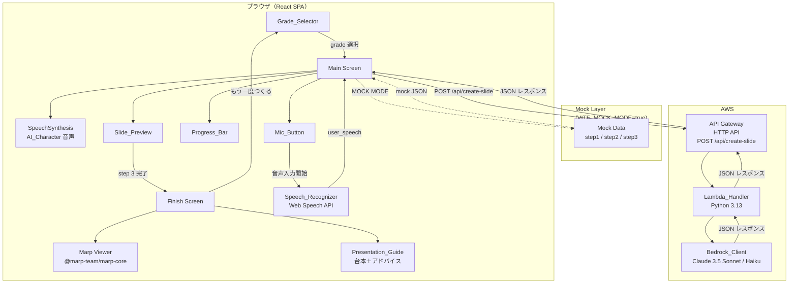
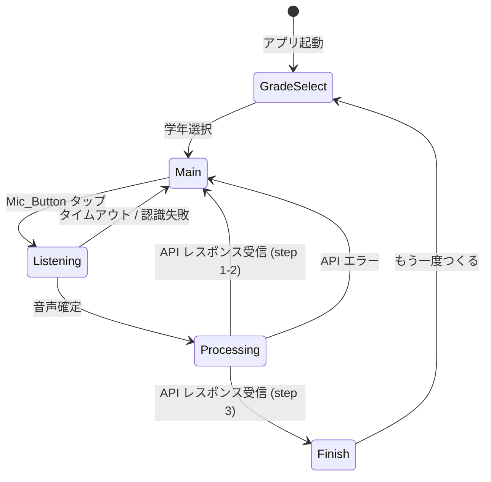
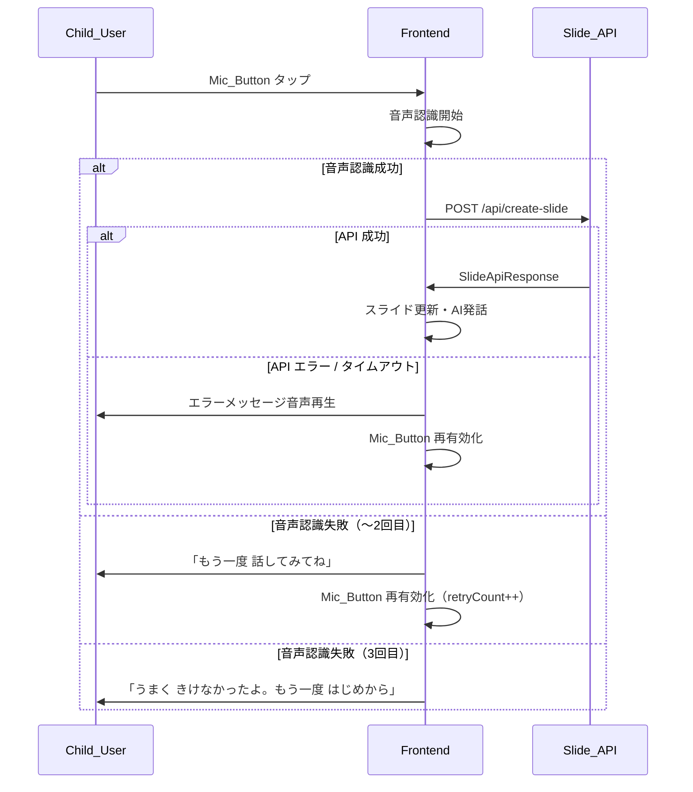

# Design Document: はなして・つくるん

## Overview

「はなして・つくるん」は、幼稚園〜中学生以上の子どもを対象とした音声対話型スライドビルダーWebアプリケーションである。ユーザーはキーボードを一切操作せず、AIキャラクター（優しい女性の先生）との3ターンの音声会話だけで、「紙芝居風スライド3枚」と「サンプルスライド（Marp形式）」を完成させることができる。完成画面では Marp によるスライドレンダリングに加え、各ページごとの台本とプレゼンアドバイス（Presentation_Guide）が表示される。

### 設計の方針

- **キーボード不要**: すべての操作は音声入力とタッチ/マウスクリックのみ
- **漸進的開示**: 3ステップ（つかみ→展開→結論）のシンプルなフローで子どもの認知負荷を最小化
- **テーマに応じた動的質問**: AIがユーザーの回答に基づいて次の質問を動的に調整し、伝えたい内容を引き出す
- **リアルタイムフィードバック**: スライドプレビューの即時更新で達成感を演出
- **Marp スライド出力**: 完成時に Marp 形式の Markdown スライドを生成し、`@marp-team/marp-core` でレンダリング
- **プレゼンガイド**: 各ページの台本＋プレゼンの構造的アドバイスで「伝え方」を学べる
- **モック対応**: `VITE_MOCK_MODE` による開発・デモ用単独動作モード

### 技術スタック

| レイヤー | 技術 |
|---------|------|
| フロントエンド | React 18 + TypeScript + Vite |
| 音声入力 | Web Speech API (`SpeechRecognition`) |
| 音声出力 | Web Speech API (`SpeechSynthesis`) |
| UIコンポーネント | Lucide React（アイコン） |
| スライドレンダリング | `@marp-team/marp-core`（Marp Markdown → HTML スライド変換） |
| バックエンド | AWS Lambda (Python 3.13) + Amazon API Gateway (HTTP API) |
| AI | Amazon Bedrock – Claude 3.5 Sonnet / Haiku |
| ホスティング | （静的ファイル配信：S3 + CloudFront 等を想定） |

---

## Architecture

### 全体構成図



### フロントエンド状態遷移



---

## Components and Interfaces

### フロントエンド コンポーネント構成

```
src/
├── App.tsx                    # ルートコンポーネント・画面切替
├── components/
│   ├── GradeSelector/
│   │   └── GradeSelector.tsx  # 学年選択画面
│   ├── MainScreen/
│   │   ├── MainScreen.tsx     # メイン画面（スライド作成）
│   │   ├── MicButton.tsx      # 巨大マイクボタン
│   │   ├── AICharacter.tsx    # AIキャラクター吹き出し表示
│   │   └── ProgressBar.tsx    # すごろく風進捗バー
│   ├── SlidePreview/
│   │   ├── SlidePreview.tsx   # 3枚スライドプレビュー領域
│   │   ├── SlideCard.tsx      # 1枚スライドカード
│   │   └── SlideIcon.tsx      # image_keyword → Lucide アイコン
│   └── FinishScreen/
│       ├── FinishScreen.tsx   # 完成画面（Marpスライド＋ガイド）
│       ├── MarpSlideViewer.tsx # Marp Markdown → HTML レンダリング＋ページナビ
│       └── PresentationGuide.tsx # 台本＋プレゼンアドバイス表示
├── hooks/
│   ├── useSpeechRecognizer.ts # Web Speech API ラッパー
│   ├── useSpeechSynthesis.ts  # SpeechSynthesis ラッパー
│   └── useSlideApi.ts         # Slide_API 呼び出しフック
├── services/
│   └── slideApiService.ts     # HTTP クライアント（モック切替含む）
├── mocks/
│   └── mockResponses.ts       # VITE_MOCK_MODE 用固定レスポンス
├── types/
│   └── index.ts               # 共通型定義
└── utils/
    └── kanjiGrade.ts          # 学年ラベル・定数
```

### 主要コンポーネント インターフェース

#### `GradeSelector`

```typescript
interface GradeSelectorProps {
  onSelect: (grade: Grade) => void;
}
```

#### `MainScreen`

```typescript
interface MainScreenProps {
  grade: Grade;
  onComplete: (slides: SlideData[], marpMarkdown: string, presentationGuide: PresentationGuideEntry[]) => void;
  onChangeGrade: () => void;
}
```

#### `MicButton`

```typescript
interface MicButtonProps {
  disabled: boolean;       // AI発話中・API処理中は true
  recording: boolean;      // 録音中は true（アニメーション制御）
  onClick: () => void;
}
```

#### `SlideCard`

```typescript
interface SlideCardProps {
  step: Step;              // 1 | 2 | 3
  data: SlideData | null;  // null = 未完成（プレースホルダー表示）
  loading: boolean;        // API処理中ローディング表示
}
```

#### `SlideIcon`

```typescript
interface SlideIconProps {
  keyword: string;         // image_keyword（英単語）
  size?: number;
}
// keyword を PascalCase に変換し lucide-react から動的ルックアップ
// 存在しない場合は Star アイコンにフォールバック
```

#### `ProgressBar`

```typescript
interface ProgressBarProps {
  currentStep: Step;       // 1 | 2 | 3
  completedSteps: Step[];  // 完了済みステップ配列
}
```

#### `FinishScreen`

```typescript
interface FinishScreenProps {
  marpMarkdown: string;            // Marp 形式の Markdown テキスト
  presentationGuide: PresentationGuideEntry[];  // 3要素の台本＋アドバイス
  onRestart: () => void;
}
```

#### `MarpSlideViewer`

```typescript
interface MarpSlideViewerProps {
  markdown: string;               // Marp 形式 Markdown
  currentPage: number;            // 現在表示中のページ (0-indexed)
  onPageChange: (page: number) => void;
}
// @marp-team/marp-core を使用して Markdown → HTML に変換し、
// 1ページずつ表示。左右ナビゲーションボタンでページ送り。
```

#### `PresentationGuide`

```typescript
interface PresentationGuideProps {
  guide: PresentationGuideEntry;  // 現在のページに対応するガイド
}
// 「このページで はなすこと」ラベル下に script を表示
// 「プレゼンの コツ」ラベル下に advice を表示
```

### カスタムフック インターフェース

#### `useSpeechRecognizer`

```typescript
interface SpeechRecognizerState {
  isListening: boolean;
  transcript: string;
  error: string | null;
}

function useSpeechRecognizer(options: {
  lang: string;            // 'ja-JP'
  timeoutMs: number;       // 10000 (10秒)
  maxRetries: number;      // 2
  onResult: (text: string) => void;
  onTimeout: () => void;
  onError: (retryCount: number) => void;
}): {
  state: SpeechRecognizerState;
  start: () => void;
  stop: () => void;
}
```

#### `useSpeechSynthesis`

```typescript
function useSpeechSynthesis(): {
  speak: (text: string, onEnd?: () => void) => void;
  isSpeaking: boolean;
  cancel: () => void;
}
```

#### `useSlideApi`

```typescript
function useSlideApi(): {
  call: (req: SlideApiRequest) => Promise<SlideApiResponse>;
  loading: boolean;
  error: string | null;
}
```

### バックエンド Lambda ハンドラー インターフェース

```python
# エントリポイント: handler.py
import json
from typing import Any

def lambda_handler(event: dict[str, Any], context: Any) -> dict[str, Any]:
    ...
```

バックエンド内部モジュール構成:

```
lambda/
├── handler.py          # Lambda エントリポイント
├── validator.py        # リクエストバリデーション
├── kanji_filter.py     # Kanji_Filter（grade 別プロンプト指示生成）
├── bedrock_client.py   # Bedrock_Client（invoke_model ラッパー）
├── slide_exporter.py   # Slide_Exporter（step3 Marp Markdown + presentation_guide 生成指示）
└── types.py            # 共通型定義（TypedDict / dataclass）
```

---

## Data Models

### フロントエンド 型定義

```typescript
// 学年区分
type Grade = 'grade0' | 'grade1' | 'grade2' | 'grade3'
           | 'grade4' | 'grade5' | 'grade6' | 'grade7';

// スライド作成ステップ
type Step = 1 | 2 | 3;

// 1枚分のスライドデータ
interface SlideData {
  step: Step;
  slide_title: string;
  slide_text: string;
  image_keyword: string;
}

// Slide_API リクエスト
interface SlideApiRequest {
  grade: Grade;
  current_step: Step;
  user_speech: string;    // 1文字以上
  history: HistoryEntry[];
}

// Slide_API レスポンス
interface SlideApiResponse {
  slide_title: string;
  slide_text: string;
  image_keyword: string;  // 英単語
  ai_response_voice: string;
  next_step: 2 | 3 | 4;  // 4 = 完成
  marp_markdown: string;  // step 3 のみ Marp 形式 Markdown（3ページ）、それ以外は空文字
  presentation_guide: PresentationGuideEntry[];  // step 3 のみ3要素、それ以外は空配列
}

// Presentation Guide エントリ
interface PresentationGuideEntry {
  page: 1 | 2 | 3;
  script: string;         // そのページで話す台本
  advice: string;         // プレゼンの構造・伝え方アドバイス
}

// 会話履歴エントリ
interface HistoryEntry {
  role: 'user' | 'assistant';
  content: string;
}

// アプリグローバル状態
interface AppState {
  screen: 'grade_select' | 'main' | 'finish';
  grade: Grade | null;
  currentStep: Step;
  completedSteps: Step[];
  slides: (SlideData | null)[];  // インデックス 0=step1, 1=step2, 2=step3
  history: HistoryEntry[];       // 最大20件
  marpMarkdown: string;          // step 3 完了時に設定
  presentationGuide: PresentationGuideEntry[];  // step 3 完了時に設定
}
```

### Bedrock プロンプト構造

Lambda_Handler は以下の構造でプロンプトを組み立てる:

```
system: |
  あなたは優しい女性の先生AIキャラクターです。
  小学生の発表会用スライドを一緒に作ります。
  
  【出力フォーマット（JSON）】
  {
    "slide_title": "...",
    "slide_text": "...",
    "image_keyword": "英単語1語",
    "ai_response_voice": "次の質問または完成メッセージ",
    "next_step": <2|3|4>,
    "marp_markdown": "<step3のみ Marp形式Markdown 3ページ、それ以外は空文字>",
    "presentation_guide": [<step3のみ3要素、それ以外は空配列>]
  }
  
  【漢字制限】
  <grade に応じた Kanji_Filter プロンプト指示>
  この制限は「slide_text」「ai_response_voice」「marp_markdown」
  「presentation_guide 内の script / advice」のすべてに適用してください。
  
  【現在のステップ】step <current_step>
  
  【ステップ別質問指示】
  <step1: テーマの輪郭を具体化する質問。「それってどんなもの？」
   「みんなに知ってほしいポイントは？」のようにテーマを掘り下げる>
  <step2: Step1で得たテーマに基づき、具体的なエピソードや詳細を引き出す質問。
   「いちばんすきなところ」「おもしろかったこと」「びっくりしたこと」>
  <step3: これまでの会話を踏まえた締めくくりの質問。
   「さいごにみんなにつたえたいきもちは？」「これからどうしたい？」>
  
  <Slide_Exporter 指示（step3のみ）>

messages: <history 配列> + [{ role: "user", content: user_speech }]
```

### Slide_Exporter プロンプト指示（step 3 のみ）

```
【Marp スライド生成指示】
marp_markdownフィールドに以下の形式でMarp Markdownを生成してください：
- 先頭に YAML フロントマター: ---\nmarp: true\ntheme: default\npaginate: true\n---
- 各スライドを --- で区切った3ページ構成
- 各ページに対応するステップの slide_title を見出し（#）、slide_text を本文
- image_keyword を <!-- icon: {keyword} --> コメントとして埋め込む

【プレゼンガイド生成指示】
presentation_guideフィールドに以下の3要素の配列を生成してください：
- page 1: 導入の台本（script）+ 「つかみ」の役割アドバイス（advice）
  - advice例: 聞き手の興味を引くための話し方のコツを小学生にわかる言葉で
- page 2: 展開の台本（script）+ 「いちばんつたえたいこと」の役割アドバイス（advice）
  - advice例: 具体例を使って印象づける方法を小学生にわかる言葉で
- page 3: 結論の台本（script）+ 「まとめ」の役割アドバイス（advice）
  - advice例: 気持ちを伝えてまとめる方法を小学生にわかる言葉で
```

### Kanji_Filter プロンプト指示マッピング

| grade | プロンプト指示 |
|-------|---------------|
| grade0 | 漢字を一切使わず、ひらがな・カタカナのみで出力してください。 |
| grade1 | 文部科学省指定の小学1年生配当漢字（80字）のみ使用してください。それ以外の漢字はひらがなで書いてください。 |
| grade2 | 文部科学省指定の小学1〜2年生配当漢字（計240字）のみ使用してください。 |
| grade3 | 文部科学省指定の小学1〜3年生配当漢字（計440字）のみ使用してください。 |
| grade4 | 文部科学省指定の小学1〜4年生配当漢字（計640字）のみ使用してください。 |
| grade5 | 文部科学省指定の小学1〜5年生配当漢字（計825字）のみ使用してください。 |
| grade6 | 文部科学省指定の小学1〜6年生配当漢字（計1026字）のみ使用してください。 |
| grade7 | 常用漢字（2136字）の範囲内で漢字を自由に使用してください。 |

**適用対象フィールド（全 grade 共通）:**
`slide_text`, `ai_response_voice`, `marp_markdown`, `presentation_guide` 内の `script` / `advice`

> **バグ修正メモ**: 旧実装では `slide_text` と `ai_response_voice` のみに漢字制限を明示していたため、`script`（旧）フィールドに制限が効いていなかった。新実装ではプロンプト指示文に全出力フィールドへの適用を明記する。

### モックデータ構造

```typescript
// src/mocks/mockResponses.ts
export const MOCK_RESPONSES: Record<Step, SlideApiResponse> = {
  1: {
    slide_title: "すきなどうぶつ",
    slide_text: "ぼくはいぬがすきです",
    image_keyword: "dog",
    ai_response_voice: "いいね！いぬの どんなところが すきなの？いちばん おもしろいなって おもうことを おしえて！",
    next_step: 2,
    marp_markdown: "",
    presentation_guide: []
  },
  2: {
    slide_title: "いちばん すきなところ",
    slide_text: "なでるとふわふわでかわいい",
    image_keyword: "heart",
    ai_response_voice: "ふわふわで かわいいんだね！さいごに、いぬと これから どうしたいか、みんなに つたえたい きもちを おしえて！",
    next_step: 3,
    marp_markdown: "",
    presentation_guide: []
  },
  3: {
    slide_title: "まとめ",
    slide_text: "いぬはともだちです",
    image_keyword: "star",
    ai_response_voice: "すばらしい はっぴょうが できたよ！",
    next_step: 4,
    marp_markdown: `---
marp: true
theme: default
paginate: true
---

# すきなどうぶつ

ぼくはいぬがすきです

<!-- icon: dog -->

---

# いちばん すきなところ

なでるとふわふわでかわいい

<!-- icon: heart -->

---

# まとめ

いぬはともだちです

<!-- icon: star -->`,
    presentation_guide: [
      {
        page: 1,
        script: "みなさん、こんにちは。きょうは ぼくの すきな どうぶつ、いぬについて おはなしします。",
        advice: "さいしょに じこしょうかいと テーマを つたえよう。みんなが「なんの はなしかな？」と きになるように はなすのが コツだよ！"
      },
      {
        page: 2,
        script: "ぼくが いぬの いちばん すきなところは、なでると ふわふわで かわいいところです。まいにち いっしょに あそんでいます。",
        advice: "いちばん つたえたい ことを くわしく はなそう。「いつ」「どこで」「どんなふうに」を いれると、みんなに つたわりやすいよ！"
      },
      {
        page: 3,
        script: "いぬは ぼくの だいすきな ともだちです。これからも ずっと なかよく していきたいです。",
        advice: "さいごは じぶんの きもちで しめよう。「だから ○○です」「これからも ○○したいです」と まとめると、きいている ひとが なっとく するよ！"
      }
    ]
  }
};
```

---

## Correctness Properties

*A property is a characteristic or behavior that should hold true across all valid executions of a system — essentially, a formal statement about what the system should do. Properties serve as the bridge between human-readable specifications and machine-verifiable correctness guarantees.*

> **プリワーク要約**: 10要件・37受入基準を分析し、Property（普遍的性質・プロパティテスト向き）9項目、Example（具体例・ユニットテスト向き）多数、Edge_Case 数件を特定した。プロパティ間の重複を検討した結果、2.5・2.6・10.3（AI発話中の状態一貫性）は1つのプロパティに統合し、計8プロパティに集約した。

---

### Property 1: 会話履歴の最大件数上限（History Capped）

*For any* 発話操作の繰り返し回数（21回以上を含む）に対して、`history` 配列のエントリ数は常に 20 件以下である。

**Validates: Requirements 8.4**

---

### Property 2: 会話履歴のラウンドトリップ整合性（History Round-Trip）

*For any* ユーザー発話テキスト `user_speech` と対応する `ai_response_voice` テキストのペアについて、Slide_API レスポンス受信後に `history` 配列を参照すると、末尾に `{ role: "user", content: user_speech }` と `{ role: "assistant", content: ai_response_voice }` の2エントリが正しく追記されている。

**Validates: Requirements 8.2, 8.3**

---

### Property 3: 学年別漢字制限の適用（Kanji Constraint Propagation）

*For any* `grade` 値（grade0〜grade7）について、Bedrock_Client に渡されるプロンプトには、その grade に対応する漢字制限指示（grade0: ひらがな・カタカナのみ〜grade7: 常用漢字制限なし）が含まれている。また `ai_response_voice`、`marp_markdown`、`presentation_guide` 内の `script` / `advice` フィールドに対しても同等の漢字制限指示が含まれている。

**Validates: Requirements 5.1, 5.2, 5.3, 5.4, 5.5, 5.6, 5.7, 5.8, 5.9**

---

### Property 4: 無効リクエストのバリデーション拒否（Request Validation Rejection）

*For any* `grade`（`"grade0"`〜`"grade7"` の範囲外）または `current_step`（1, 2, 3 の範囲外）の値を含むリクエストについて、Lambda_Handler は Bedrock_Client を一切呼び出すことなく HTTP 400 を返す。

**Validates: Requirements 4.8, 5.10**

---

### Property 5: step=3 の Marp Markdown 生成（Marp Output on Final Step）

*For any* `current_step = 3` のリクエストについて、生成されたレスポンス内の `marp_markdown` フィールドは非空文字列であり、先頭に `marp: true` を含む YAML フロントマターを持ち、`---` で区切られた3ページ構成である。また `presentation_guide` フィールドは3要素の配列であり、各要素は `page`（1, 2, 3）、`script`（非空文字列）、`advice`（非空文字列）を持つ。

**Validates: Requirements 7.1, 7.2**

---

### Property 6: step≠3 のとき marp_markdown は空文字列・presentation_guide は空配列（Empty Output for Non-Final Steps）

*For any* `current_step` が 1 または 2 のリクエストについて、レスポンス内の `marp_markdown` フィールドは必ず空文字列 `""` であり、`presentation_guide` フィールドは必ず空配列 `[]` である。

**Validates: Requirements 4.4**

---

### Property 7: SlideIcon のエラーレスフォールバック（Icon Error-Free Fallback）

*For any* 文字列値（有効な Lucide アイコン名・無効な文字列・空文字列を含む）を `image_keyword` として SlideIcon コンポーネントに渡したとき、コンポーネントは必ず何らかの Lucide アイコンを描画し、対応するアイコンが存在しない場合は `Star` アイコンを描画する（例外・描画エラー・undefined レンダリングを一切引き起こさない）。

**Validates: Requirements 6.4, 6.5**

---

### Property 8: Grade_Selector 表示時の履歴完全リセット（History Full Reset）

*For any* `history` 配列の状態（エントリ数 0〜20件）において、Grade_Selector 画面への遷移が発生すると `history` は必ず空配列 `[]` に初期化される。

**Validates: Requirements 8.5**

---

### Property 9: AI_Character 発話中の状態一貫性（Speaking State Consistency）

*For any* `ai_response_voice` テキストについて、AI_Character が音声を再生している（`isSpeaking = true`）あいだは、Mic_Button の `disabled` が `true` であり、かつ `ai_response_voice` のテキストが画面上に表示されている。`isSpeaking = false` に遷移した瞬間、Mic_Button の `disabled` は `false` に戻る。

**Validates: Requirements 2.5, 2.6, 10.3**

---

## Error Handling

### フロントエンド エラー処理

| エラー状況 | 処理 |
|-----------|------|
| 音声認識タイムアウト（10秒） | タイムアウトとして認識停止、エラーメッセージ音声再生、Mic_Button 再有効化 |
| 音声認識失敗（1〜2回目） | 「もう一度 話してみてね」音声再生、Mic_Button 再有効化 |
| 音声認識失敗（3回目） | 「うまく きけなかったよ。もう一度 はじめから」固定メッセージ表示 |
| Slide_API タイムアウト（15秒） | ローディング停止、「もう一度 やってみてね」音声再生、Mic_Button 再有効化 |
| Slide_API レスポンス `ai_response_voice` が空 | 「もう一度 やってみてね」音声再生、Mic_Button 再有効化 |
| Slide_API HTTP エラー（4xx / 5xx） | 「もう一度 やってみてね」音声再生、Mic_Button 再有効化 |

### バックエンド エラー処理

| エラー状況 | HTTP ステータス | レスポンス |
|-----------|---------------|-----------|
| 必須フィールド欠如 | 400 | `{"error": "invalid request"}` |
| grade / current_step 値域外 | 400 | `{"error": "invalid request"}` |
| Bedrock 呼び出しエラー | 500 | `{"error": "<エラー内容>"}` |
| Bedrock レスポンス JSON パースエラー | 500 | `{"error": "response parse error"}` |
| 処理時間 10 秒超過 | 504（Lambda タイムアウト） | API Gateway デフォルト |

### エラー回復フロー



---

## Testing Strategy

### テストアプローチ

本アプリは以下の2種類のテストで品質を保証する：

1. **ユニットテスト（Vitest + React Testing Library / pytest）**: 具体的なシナリオ、エッジケース、エラー状態を検証
2. **プロパティベーステスト（fast-check / hypothesis）**: 上記 Correctness Properties に対応する普遍的性質を多数の生成入力で検証
   - フロントエンド（TypeScript）: **fast-check**
   - Lambda バックエンド（Python）: **hypothesis**

### ユニットテスト対象

- `GradeSelector`: 8種類の学年ボタン表示、選択時コールバック
- `MicButton`: disabled / recording / 通常状態の外観
- `SlideCard`: data=null（プレースホルダー）、loading=true（ローディング）、data 有（スライド表示）
- `SlideIcon`: 既知キーワード → 正しいアイコン、未知キーワード → Star フォールバック
- `ProgressBar`: 各ステップ状態（未着手・現在・完了）の識別可能表示
- `useSpeechRecognizer`: タイムアウト動作、リトライカウント、最大リトライ超過
- `slideApiService`: VITE_MOCK_MODE 切替（モックレスポンス vs fetch 呼び出し）
- `validator.py` (Lambda): 全フィールドの有効・無効入力組合せ
- `kanji_filter.py` (Lambda): 各 grade に対するプロンプト指示文字列検証

### プロパティベーステスト（fast-check / hypothesis）

各プロパティテストは最小 100 イテレーション実行する。
タグ形式: `Feature: hanashite-tsukurun, Property {番号}: {プロパティ内容}`

| テスト | 対応 Property | 生成入力 | 検証内容 | ライブラリ |
|-------|-------------|---------|---------|-----------|
| 履歴件数上限 | Property 1 | 任意回数の発話イベント列 | `history.length <= 20` | fast-check (フロントエンド) |
| 履歴ラウンドトリップ | Property 2 | 任意の `user_speech` / `ai_response_voice` ペア | 末尾2エントリが正しい role / content | fast-check (フロントエンド) |
| 漢字制限プロンプト | Property 3 | 任意の grade × user_speech | プロンプト文字列に全フィールド対象の漢字制限指示が含まれる | hypothesis (Lambda/Python) |
| バリデーション | Property 4 | 範囲外 grade / current_step 値 | Bedrock 未呼び出し + HTTP 400 | hypothesis (Lambda/Python) |
| Marp出力（step 3） | Property 5 | 任意の step=3 リクエスト（モック） | `marp_markdown` が非空 + Marp フロントマター + 3ページ構成; `presentation_guide` が3要素 | fast-check (フロントエンド) |
| 空出力（step 1, 2） | Property 6 | 任意の step=1 or 2 リクエスト（モック） | `marp_markdown === ""` かつ `presentation_guide === []` | fast-check (フロントエンド) |
| アイコンフォールバック | Property 7 | 任意の文字列（有効・無効・空） | エラーなくアイコン描画される | fast-check (フロントエンド) |
| 履歴リセット | Property 8 | 任意の history 状態 | GradeSelector 表示後 `history === []` | fast-check (フロントエンド) |
| AI発話中状態一貫性 | Property 9 | 任意の ai_response_voice テキスト | isSpeaking=true → disabled=true かつテキスト表示中; isSpeaking=false → disabled=false | fast-check (フロントエンド) |

### インテグレーションテスト（オプション）

- Lambda ハンドラーのエンドツーエンド呼び出し（Bedrock をモック）
- API Gateway → Lambda の疎通確認（デプロイ後スモークテスト）

### テストコマンド

```bash
# フロントエンド
pnpm test --run           # Vitest（シングル実行）

# Lambda (Python)
cd lambda && python -m pytest -q

# プロパティテストのイテレーション数指定
# フロントエンド（fast-check）: vitest.config.ts の globalSetup または各テストファイルで
# fc.configureGlobal({ numRuns: 100 }) を設定
# Lambda（hypothesis）: settings デコレーターまたは hypothesis.ini で
# max_examples=100 を設定
```
