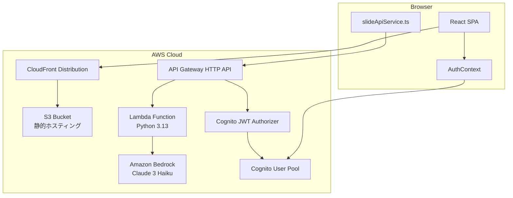
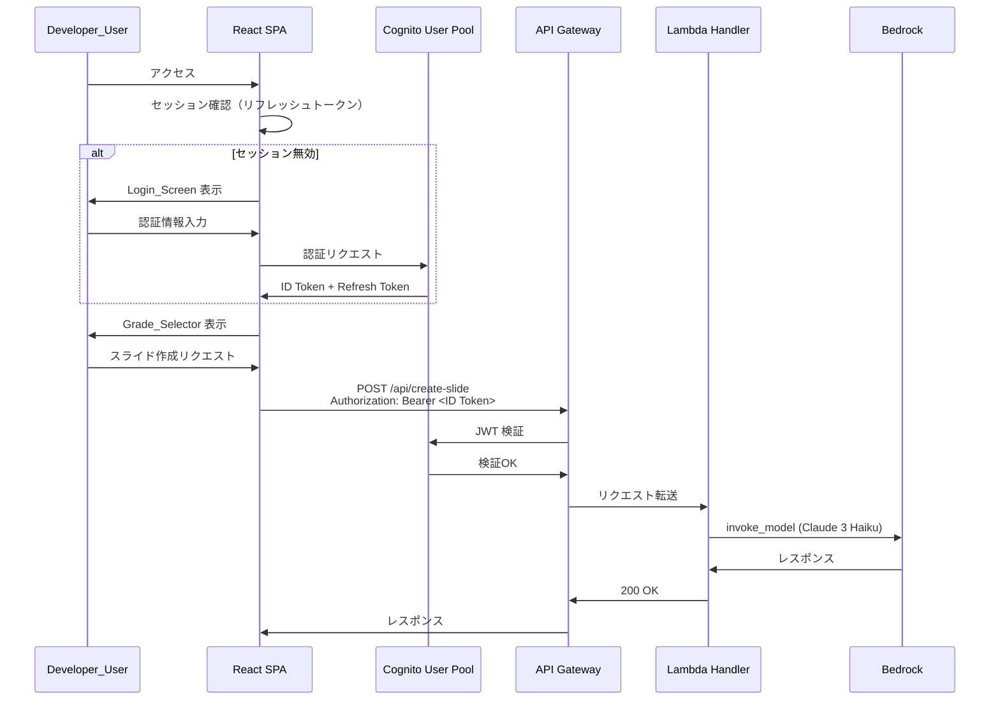

# Design Document: Secure Deployment

## Overview

本設計は「はなして・つくるん」アプリに認証・認可・静的ホスティングのインフラを追加し、安全なデプロイメントを実現する。主要コンポーネントは以下のとおり:

1. **AWS CDK スタック**: Cognito User Pool、API Gateway（HTTP API + JWT Authorizer）、Lambda、S3、CloudFront を単一スタックで定義
2. **フロントエンド認証レイヤー**: React Context を使った認証状態管理、ログイン画面、トークンライフサイクル管理
3. **バックエンド変更**: モデルID の環境変数化と Claude 3 Haiku への切り替え
4. **VITE_MOCK_MODE 対応**: 開発時の認証バイパス機構

### 設計方針

- **単一ユーザー前提**: セルフサインアップ無効、管理者が1アカウントのみ作成
- **パスキー優先、パスワードフォールバック**: Cognito の機能サポート状況に応じて柔軟に切り替え
- **既存コード最小変更**: `slideApiService.ts` への Authorization ヘッダー付与と、App.tsx を AuthProvider でラップする程度の変更に抑える
- **IaC ファースト**: 手動リソース作成ゼロ。`cdk deploy` 一発で全環境構築

---

## Architecture



### 認証フロー



---

## Components and Interfaces

### 1. CDK Stack (`infra/lib/hanashite-tsukurun-stack.ts`)

TypeScript で記述する AWS CDK v2 スタック。全リソースを単一スタックに定義する。

```typescript
// 主要コンストラクト
interface HanashiteTsukurunStackProps extends cdk.StackProps {
  // スタック名から自動的にリソースプレフィックスを生成
}

// 定義リソース:
// - Cognito User Pool + App Client
// - S3 Bucket (OAC付き)
// - CloudFront Distribution
// - HTTP API (API Gateway v2)
// - Cognito JWT Authorizer
// - Lambda Function (Python 3.13, 30秒タイムアウト)
// - BucketDeployment (dist/ → S3)
```

### 2. AuthContext (`src/contexts/AuthContext.tsx`)

React Context + カスタムフックによる認証状態管理。

```typescript
interface AuthState {
  isAuthenticated: boolean;
  isLoading: boolean;       // 初回セッション確認中
  idToken: string | null;
  error: string | null;
}

interface AuthContextValue extends AuthState {
  login: (username: string, password: string) => Promise<void>;
  loginWithPasskey: () => Promise<void>;
  logout: () => void;
  getToken: () => string | null;  // 現在の有効なトークンを返す
}

// フック
function useAuth(): AuthContextValue;
```

**トークン保持方針**: セッションストレージに暗号化せずJWTを保持（要件2.7 準拠）。ローカルストレージは使用しない。ただしリフレッシュトークンのみメモリ内変数に保持し、ページリロード時はセッションストレージのIDトークン有効期限確認 → 期限切れならリフレッシュフロー実行。

### 3. Login Screen (`src/components/LoginScreen/LoginScreen.tsx`)

```typescript
interface LoginScreenProps {
  onLoginSuccess: () => void;
}

// パスキー認証モードとパスワード認証モードを authMethod 設定で切り替え
// エラー時は「ログインに失敗しました」メッセージを表示
```

### 4. Cognito Client (`src/services/cognitoService.ts`)

AWS SDK (`@aws-sdk/client-cognito-identity-provider`) を使った Cognito 操作ラッパー。

```typescript
interface CognitoConfig {
  userPoolId: string;
  clientId: string;
  region: string;
}

// 主要関数
function initiateAuth(username: string, password: string): Promise<AuthTokens>;
function refreshToken(refreshToken: string): Promise<AuthTokens>;
function signOut(): Promise<void>;

interface AuthTokens {
  idToken: string;
  accessToken: string;
  refreshToken: string;
  expiresIn: number;
}
```

### 5. slideApiService.ts 変更

既存の `callSlideApi` に Authorization ヘッダーを追加する。

```typescript
// 変更点: getToken 関数を引数またはインポートで受け取り、
// Authorization: Bearer <token> ヘッダーを付与
export async function callSlideApi(
  req: SlideApiRequest,
  token?: string | null
): Promise<SlideApiResponse> {
  // モックモードの場合はトークン不要
  if (import.meta.env.VITE_MOCK_MODE === 'true') { /* 既存ロジック */ }

  // 本番モード: Authorization ヘッダー付与
  const headers: Record<string, string> = {
    'Content-Type': 'application/json',
    ...(token ? { 'Authorization': `Bearer ${token}` } : {}),
  };
  // ... fetch 呼び出し
  // 401 レスポンス時は AuthError をスローし、上位で Login_Screen 遷移を発火
}
```

### 6. Lambda Handler 変更 (`lambda/handler.py`)

```python
# 変更: DEFAULT_MODEL_ID を環境変数から読み取り
import os

DEFAULT_MODEL_ID = os.environ.get(
    "BEDROCK_MODEL_ID",
    "anthropic.claude-3-haiku-20240307-v1:0"
)
```

---

## Data Models

### Cognito User Pool 設定

| 項目 | 値 |
|------|-----|
| セルフサインアップ | 無効 |
| MFA | なし（単一ユーザーのため） |
| パスワードポリシー | Cognito デフォルト（8文字以上、大小英数記号） |
| ID トークン有効期限 | 1時間 |
| リフレッシュトークン有効期限 | 30日 |
| App Client シークレット | なし |
| 認証フロー | USER_PASSWORD_AUTH（パスキー非サポート時） |

### フロントエンド環境変数

| 変数名 | 用途 | 値の例 |
|--------|------|--------|
| `VITE_MOCK_MODE` | モックモード切替 | `"true"` / 未設定 |
| `VITE_COGNITO_USER_POOL_ID` | Cognito User Pool ID | `ap-northeast-1_XXXXXXX` |
| `VITE_COGNITO_CLIENT_ID` | App Client ID | `xxxxxxxxxxxxxxxxxxxxxxxxxx` |
| `VITE_COGNITO_REGION` | リージョン | `ap-northeast-1` |
| `VITE_API_ENDPOINT` | API Gateway エンドポイント | `https://xxx.execute-api.ap-northeast-1.amazonaws.com` |

### Lambda 環境変数

| 変数名 | 用途 | 値 |
|--------|------|-----|
| `BEDROCK_MODEL_ID` | 使用するBedrockモデル | `anthropic.claude-3-haiku-20240307-v1:0` |

### CDK コンテキストパラメータ

```typescript
// cdk.json または cdk.context.json
{
  "stackName": "hanashite-tsukurun",
  "authMethod": "password"  // "passkey" | "password"
}
```

---

## Error Handling

### フロントエンド

| シナリオ | 処理 |
|----------|------|
| ログイン失敗（不正な認証情報） | Login_Screen に「ログインに失敗しました」メッセージを表示、フォーム再表示 |
| トークン期限切れ（API 呼び出し前） | リフレッシュトークンで自動更新を試行 |
| リフレッシュトークン期限切れ | Login_Screen に遷移、再認証要求 |
| Slide_API 401 レスポンス | Auth_Token を破棄、Login_Screen に遷移 |
| Slide_API 500 レスポンス | エラーメッセージ表示（既存動作を維持） |
| ネットワークエラー | 既存のエラーハンドリング（useSlideApi フックの error ステート） |

### バックエンド

| シナリオ | 処理 |
|----------|------|
| JWT Authorizer 検証失敗 | API Gateway が 401 を返す（Lambda 未実行） |
| OPTIONS プリフライト | API Gateway レベルで認証なし CORS レスポンス |
| Bedrock 呼び出しエラー | 既存の 500 レスポンス（変更なし） |
| 環境変数 `BEDROCK_MODEL_ID` 未設定 | デフォルト値 `anthropic.claude-3-haiku-20240307-v1:0` を使用 |

### CDK デプロイ

| シナリオ | 処理 |
|----------|------|
| `dist/` ディレクトリ未存在 | `cdk deploy` 前に `pnpm build` 実行を必須とする（README に明記） |
| 権限不足 | CDK が IAM ポリシーエラーを報告 |

---

## Testing Strategy

### PBT 適用性評価

本フィーチャーは以下の理由により、Property-Based Testing (PBT) は **適用しない**:

1. **IaC（CDK）**: 宣言的設定であり、入出力を持つ関数ではない。スナップショットテストで検証する。
2. **認証フロー**: 外部サービス（Cognito）との連携であり、PBT の入力空間が意味を持たない。モックベースのユニットテストで検証する。
3. **UI 状態管理**: 状態遷移は有限であり、100回のランダム入力より具体的なシナリオテストの方が効果的。
4. **API Gateway 認可**: インフラ設定の検証であり、統合テストで確認する。

### テスト方針

#### 1. CDK スナップショットテスト

```typescript
// infra/test/stack.test.ts
// cdk synth の出力を検証し、リソース定義の回帰を検出
test('CDK stack matches snapshot', () => {
  const app = new cdk.App();
  const stack = new HanashiteTsukurunStack(app, 'Test');
  const template = Template.fromStack(stack);
  // 各リソースの存在と設定を assertion
});
```

検証対象:
- Cognito User Pool: セルフサインアップ無効、トークン有効期限
- API Gateway: JWT Authorizer 設定
- Lambda: ランタイム、タイムアウト、環境変数
- S3: パブリックアクセスブロック
- CloudFront: HTTPS リダイレクト、カスタムエラーレスポンス

#### 2. フロントエンド ユニットテスト

```typescript
// src/contexts/AuthContext.test.tsx
// Cognito SDK をモックし、状態遷移を検証
describe('AuthContext', () => {
  it('未認証時は isAuthenticated: false');
  it('ログイン成功時にトークンを保持し isAuthenticated: true');
  it('ログイン失敗時にエラーメッセージを設定');
  it('トークン期限切れ時にリフレッシュを試行');
  it('リフレッシュ失敗時に isAuthenticated: false に遷移');
  it('ログアウト時にトークンを全破棄');
});

// src/components/LoginScreen/LoginScreen.test.tsx
describe('LoginScreen', () => {
  it('パスワードモード: ユーザー名・パスワードフィールドとログインボタンを表示');
  it('認証成功時に onLoginSuccess を呼び出す');
  it('認証失敗時に「ログインに失敗しました」を表示');
});

// src/services/slideApiService.test.ts
describe('callSlideApi with auth', () => {
  it('本番モード: Authorization ヘッダーを付与');
  it('モックモード: Authorization ヘッダーなし');
  it('401 レスポンスで AuthError をスロー');
});
```

#### 3. VITE_MOCK_MODE テスト

```typescript
describe('MOCK_MODE 共存', () => {
  it('VITE_MOCK_MODE=true: 認証チェックスキップ、Login_Screen 非表示');
  it('VITE_MOCK_MODE=true: API リクエストにトークン付与しない');
  it('VITE_MOCK_MODE 未設定: 認証必須、未認証時 Login_Screen 表示');
});
```

#### 4. Lambda ユニットテスト

```python
# lambda/test_handler.py に追加
def test_model_id_from_env(monkeypatch):
    """環境変数 BEDROCK_MODEL_ID が読み込まれることを確認"""

def test_model_id_default():
    """環境変数未設定時にデフォルト値を使用することを確認"""
```

#### 5. 統合テスト（手動）

デプロイ後に以下を手動検証:
- CloudFront URL でアプリにアクセスできる
- 未認証時に Login_Screen が表示される
- ログイン後に Grade_Selector に遷移する
- Slide_API が認証済みリクエストに対して正常応答する
- 未認証リクエストに 401 が返る

### テストフレームワーク

| レイヤー | フレームワーク | 実行方法 |
|----------|---------------|----------|
| フロントエンド | Vitest + @testing-library/react | `pnpm test` |
| Lambda | pytest | `pytest lambda/` |
| CDK | Jest + aws-cdk-lib/assertions | `npx jest` (infra ディレクトリ) |

---

## Design Decisions

### D1: パスキー vs パスワード認証

**選択: パスワード認証を初期実装とする。パスキーは将来対応。**

理由:
- AWS Cognito のパスキー（WebAuthn）サポートは2024年後半に追加されたが、SDK のドキュメントとサンプルが限定的
- 単一ユーザーのため、パスワード認証でもセキュリティリスクは限定的
- パスキー対応は `authMethod` コンテキストパラメータで切り替え可能な設計としておく

### D2: Cognito SDK の選択

**選択: `@aws-sdk/client-cognito-identity-provider` を直接使用**

理由:
- Amplify ライブラリは多機能だがバンドルサイズが大きい
- 本アプリは単一エンドポイントの認証のみ必要で、Amplify の他機能は不要
- 軽量な SDK 直接利用でバンドルサイズを最小化

### D3: トークン保持場所

**選択: IDトークンをセッションストレージ、リフレッシュトークンをメモリ内変数**

理由:
- 要件2.7 でローカルストレージ使用禁止
- セッションストレージはタブ閉じで消去されセキュリティ面で優位
- リフレッシュトークンはメモリ内のみ（XSS 対策）、ページリロード時は再ログインが必要になるが単一ユーザーなら許容範囲

### D4: API Gateway タイプ

**選択: HTTP API (API Gateway v2)**

理由:
- REST API より低コスト
- JWT Authorizer をネイティブサポート
- Lambda プロキシ統合で十分
- CORS 設定もビルトイン

### D5: CDK プロジェクト配置

**選択: `infra/` ディレクトリをプロジェクトルートに新規作成**

理由:
- フロントエンド（React）とインフラ（CDK）の関心を分離
- それぞれ独立した `package.json` と `tsconfig.json` を持つ
- `lambda/` ディレクトリは既存位置のまま、CDK から相対パスで参照
